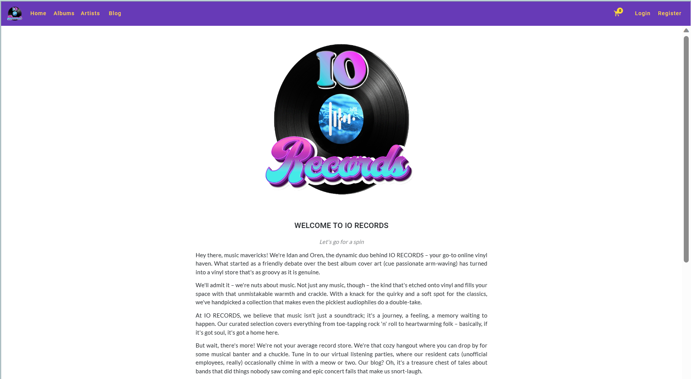
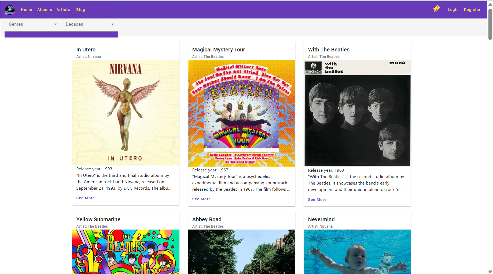
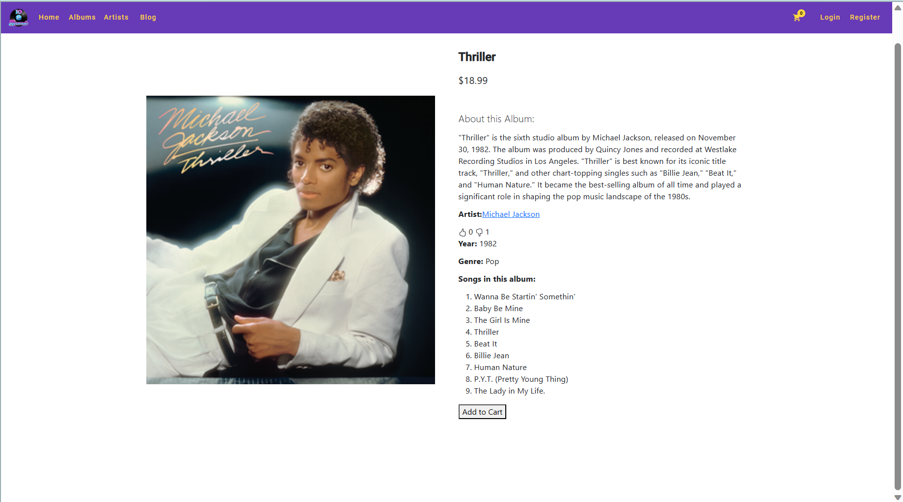
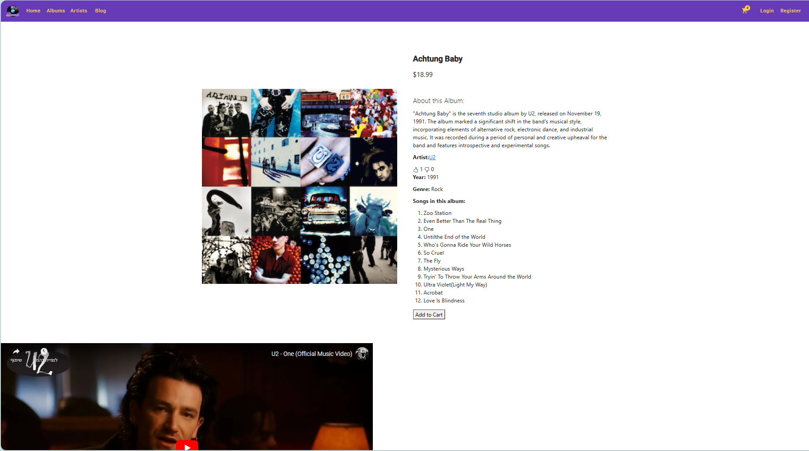
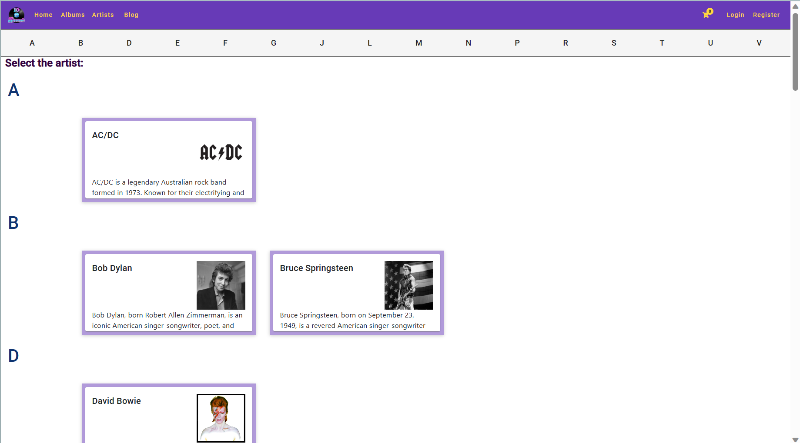
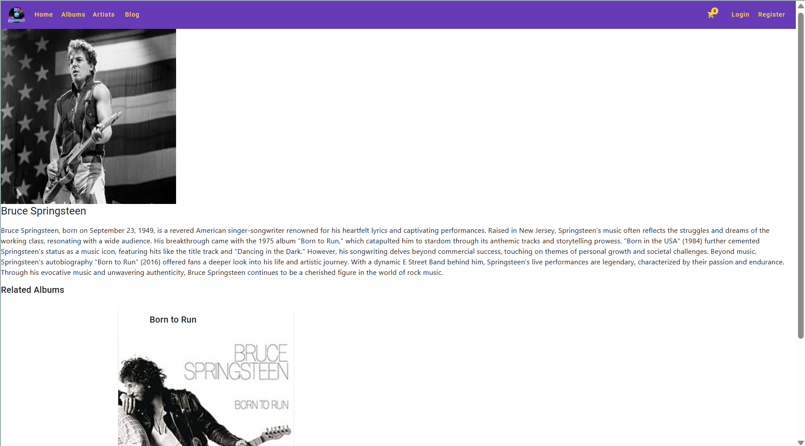

# Django + Angular Project - Music Store Web Application
This project was created in collaboration with Idan Benaim (https://github.com/Idanbenaim)

This is an ecommerce site for album records built on Django and Angular. 

Welcome to the Music Store Web Application! This application is built using Django for the backend and Angular for the frontend.

### test username: anna@yopmail.com
### test password: 123

#### Render
The Backend was uploaded to Render: https://io-records-shop-back.onrender.com

#### Netlify
The Frontend was uploaded to Netlify: https://iorecords.netlify.app

## Backend Table of Contents
This is the backend component of the Django + Angular project. It includes Django models, serializers, views, and URLs for managing artists, genres, albums, carts, orders, and more.

- [Models](#models)
- [Serializers](#serializers)
- [Views](#views)
- [URLs](#urls)

### Models

#### Artist

- `artist_name`: CharField (max_length=250)
- `artist_bio`: CharField (max_length=2000, blank=True, null=True)
- `artist_image`: ImageField (upload_to='static/images', blank=True, null=True)

#### Genre

- `genre_name`: CharField (max_length=100)

#### Album

- `artist`: ForeignKey to Artist
- `genre`: ForeignKey to Genre
- `album_title`: CharField (max_length=500)
- `albumYear`: IntegerField
- `description`: CharField (max_length=2500)
- `price`: DecimalField (max_digits=5, decimal_places=2)
- `yt_link`: CharField (max_length=1000, blank=True, null=True)
- `songs_list`: CharField (max_length=1000, null=True)
- `album_cover`: ImageField (upload_to='static/images', blank=True, null=True)

#### AlbumRating

- `album`: ForeignKey to Album
- `user`: ForeignKey to User
- `vote`: IntegerField (choices=[(1, 'Up'), (-1, 'Down')])

#### Cart

- `user`: OneToOneField to User

#### CartItem

- `cart`: ForeignKey to Cart
- `album`: ForeignKey to Album
- `quantity`: PositiveIntegerField

#### Order

- `user`: ForeignKey to User
- `firstName`: CharField (max_length=35)
- `lastName`: CharField (max_length=35)
- `email`: EmailField (max_length=100, blank=False)

#### OrderItem

- `order`: ForeignKey to Order
- `album`: ForeignKey to Album
- `qty`: IntegerField

### Serializers

- `ArtistSerializer`
- `GenreSerializer`
- `AlbumSerializer`
- `AlbumRatingSerializer`
- `CartItemSerializer`
- `CartSerializer`
- `OrderItemSerializer`
- `OrderSerializer`

### Views

#### Artists

- `manageArtists`: APIView for managing artists (GET, POST, PUT, DELETE)

#### Genres

- `manageGenres`: APIView for managing genres (GET, POST, PUT, DELETE)

#### Albums

- `manageAlbums`: APIView for managing albums (GET, POST, PUT, DELETE)

#### Album Ratings

- `manageAlbumRatings`: APIView for managing album ratings (GET, POST)

#### Carts

- `manageCarts`: APIView for managing carts (GET, POST, PUT, DELETE)

#### Orders

- `manageOrders`: APIView for managing orders (GET, POST, PUT, DELETE)

#### Order Items

- `manageOrderItems`: APIView for managing order items (GET, POST, PUT, DELETE)

### URLs

- Authentication endpoints (`auth/` and `register/`)
- Artist endpoints (`artists/`)
- Genre endpoints (`genres/`)
- Album endpoints (`albums/`)
- Cart endpoints (`cart/`)
- Order endpoints (`orders/`)
- Order item endpoints (`orderitems/`)
- Album rating endpoints (`create_album_rating/` and `get_album_ratings/<int:album_id>/`)

### Usage
#### Installation of the Backend

1. Clone the repository: `git clone https://github.com/orenzylber/IO_Records_Final_Project.git`
2. cd Back
3. Create a virtual environment: `python -m virtualenv myenv`
4. Activate the virtual environment:
   - On Windows: `myenv\Scripts\activate`
   - On macOS and Linux: `source myenv/bin/activate` 
5. Install the required packages: `pip install -r requirements.txt`
6. Run the Django development server: `python manage.py runserver`

## Frontend Table of Contents - Music Store Web Application

Welcome to the Music Store Web Application! This frontend part of the application is built using Angular for the frontend and connects to a backend API for managing albums, carts, orders, and user authentication.

### Features

- Browse and search for music albums.
- you can use the defferent filters (genre, decades, artists).
- Add albums to the shopping cart.
- View and edit the shopping cart contents.
- Proceed to checkout and place orders.
- User authentication and registration.
- View order history and details.

### Getting Started

#### Prerequisites

- Node.js (https://nodejs.org/)
- Angular CLI (https://cli.angular.io/)

#### Installation of the Frontend

1. Open a new terminal 
2. type command to change directory: `cd Front`
3. type command to change directory: `cd myapp`
4. type command to install: `nmp i`
5. type run command: `ng serve -o`

Home Page:

Albums Page:

Album Page:

YouTube link in Album Page:

Artists Page:

Artist Page:

### Inactivity Timer

A 15 minutes Inactivity Timer was added by:
- creating inactivity.service.ts
- updating app.component.ts
- adding the InactivityService as a provider in app.module.ts

### License

This project is licensed under the [MIT License](LICENSE).

